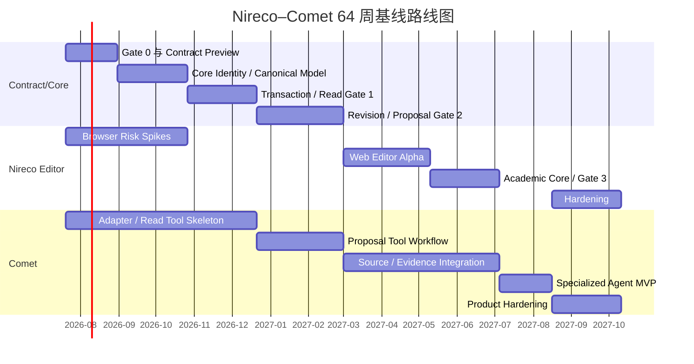

# Nireco–Comet 开发路线图

## 0. 路线图目的

本文档把《Nireco Editor 开发规格与 Comet 特化智能体集成契约》转换为可执行的时间计划、交付节奏和跨仓 Gate。

本路线图采用 **64 周、32 个双周 Sprint** 的基线计划。假设项目于 **2026 年 7 月 20 日**正式启动，在 **2027 年 10 月 10 日**形成私有 Production Candidate。若完成后还需要面向真实用户进行独立 burn-in，建议保留额外 4–6 周再决定内部 `1.0`。

本路线图不是固定工期承诺。日期依赖于第 2 节所列人员配置和范围约束。任何增加多人 CRDT、完整 DOCX 往返、精确分页、公共插件生态或外部 Agent 接入的决定，都必须重新估算关键路径。

### 0.1 规范文档依赖

本路线图只负责时间、资源、Gate 和交付顺序。产品与 Core 语义以开发规格 v0.4.2 为准；代码风格、模块边界和 CI 门禁以工程与编码规范 v0.1.1 为准。

Gate 通过不仅要求功能完成，还要求对应的规范版本、自动化配置、Fixture、Contract Bundle 和 Conformance 结果保持一致。任何通过降低编码规范或关闭门禁换取日期的做法，都视为 Gate 未通过。

## 1. 北极星与完成定义

### 1.1 北极星

Nireco 的建设目标不是完成一个功能繁多的富文本编辑器，而是形成 Comet 的 Agent-native 学术文档基础设施：

```text
Resource URI
→ Versioned Semantic Model
→ Semantic Position
→ Transaction / Revision
→ Proposal / Semantic Diff
→ Academic Evidence / Citation
→ Comet Specialized Agent
```

### 1.2 Production Candidate 的完成定义

到路线图结束时，系统必须稳定完成以下闭环：

1. 用户通过 Web Editor 使用中文或英文编辑结构化 Manuscript；
2. 所有输入产生可重放的 Transaction 和线性 Revision；
3. Comet 在固定 Revision 上读取文档和授权范围；
4. Comet 从真实 Source 创建可追溯 Evidence；
5. Comet Agent 只通过私有 Tools 创建 Proposal；
6. Proposal 可以插入正文、Claim、Evidence Link 和 Citation；
7. Nireco 生成确定性的 Semantic Diff；
8. 用户能够全部接受、部分接受或拒绝修改；
9. 接受操作产生单一主分支 Transaction；
10. Bibliography、CrossReference 和 Academic Graph 可重建；
11. Undo、Crash Recovery、Authority、Audit 和 Provenance 可验证；
12. Comet 不存在 Raw Transaction、DOM 写入或 Commit 后门；
13. 外部 Agent 无法访问 Nireco 私有能力。

## 2. 计划假设

### 2.1 推荐人员配置

基线日期假设以下有效投入，不等同于组织总人数：

| 方向 | 建议有效 FTE | 核心职责 |
|---|---:|---|
| Nireco Core / Model | 2.0 | URI、Model、Schema、Transaction、Revision、Proposal |
| Nireco Browser Runtime | 2.0 | DOM、Selection、IME、Clipboard、Review View、Accessibility |
| Nireco Platform / Conformance | 1.0 | Storage、Authority、Contract Bundle、CI、Fuzz、性能 |
| Comet Agent / Tools | 2.0 | Adapter、Private Tools、Planner、Executor、Workflow、Evaluation |
| Comet Source / Evidence | 1.0 | Source Store、提取、Evidence、Citation 验证、Context Builder |
| Comet Product / Backend | 1.0 | Task API、项目集成、权限、恢复、产品 UI |
| 共享 QA / SDET | 1.0 | 跨仓 Conformance、浏览器矩阵、故障注入、回归 |
| 共享 PM / Design / Security | 兼职 | 范围、Review UX、威胁模型、发布治理 |

建议工程投入约为 **9–10 个有效 FTE**。技术负责人可以计入上述 FTE，但必须明确 Nireco 与 Comet 各有一名 Contract DRI。

### 2.2 人员不足时的影响

- Nireco 少于 4 个有效工程 FTE：浏览器运行时与 Core 无法充分并行，基线应增加 20%–35%。
- Comet 少于 3 个有效工程 FTE：Source/Evidence 和 Agent Workflow 将串行，Gate 3 后至少增加 8–12 周。
- 没有专门 QA/SDET：浏览器、Crash Recovery 和跨仓 Conformance 风险会后移到发布阶段，不建议维持原日期。

### 2.3 开发节奏

- Sprint 长度：2 周；
- Contract Bundle：每个 Sprint 至少发布一次 Preview；
- Cross-repo CI：Gate 1 起成为合并门禁；
- 架构评审：每个 Sprint 一次；
- 产品演示：每两个 Sprint 一次；
- Roadmap 复盘：每 8 周一次；
- Gate 评审：只按验收结果通过，不按日期自动通过。

### 2.4 范围约束

Production Candidate 前明确不做：

- 公共 Agent Tools、公共 MCP、BYOA；
- 公共 Nireco SDK 或插件市场；
- 多人实时 CRDT；
- 完整 Git 式 Revision DAG；
- Word 式精确分页；
- 任意 DOCX 无损往返；
- 任意 LaTeX 宏执行；
- 任意第三方 Schema Extension；
- 复杂表格合并、嵌套块和电子表格能力；
- 移动端完整编辑体验；
- Rust/WASM 进入普通键盘输入同步路径。

## 3. 总体时间线

| 阶段 | 名称 | Sprint | 日历范围 | 时长 | 阶段出口 |
|---|---|---|---|---:|---|
| Phase 0 | Alignment, Risk Spikes & Gate 0 | S00–S02 | 2026-07-20 至 2026-08-30 | 6 周 | Gate 0 / Contract Preview |
| Phase 1 | Core Identity & Canonical Model | S03–S06 | 2026-08-31 至 2026-10-25 | 8 周 | Core Model Alpha |
| Phase 2 | Transaction Kernel & Revision-bound Read | S07–S10 | 2026-10-26 至 2026-12-20 | 8 周 | Gate 1 / Read Integration |
| Phase 3 | Revision, Durability, Proposal & Semantic Diff | S11–S15 | 2026-12-21 至 2027-02-28 | 10 周 | Gate 2 / Proposal E2E |
| Phase 4 | Web Editor Alpha | S16–S20 | 2027-03-01 至 2027-05-09 | 10 周 | Editor Alpha |
| Phase 5 | Academic Core & Evidence/Citation E2E | S21–S24 | 2027-05-10 至 2027-07-04 | 8 周 | Gate 3 / Academic Alpha |
| Phase 6 | Comet Specialized Agent MVP | S25–S27 | 2027-07-05 至 2027-08-15 | 6 周 | Comet Integrated Beta |
| Phase 7 | Production Hardening & Candidate | S28–S31 | 2027-08-16 至 2027-10-10 | 8 周 | Private Production Candidate |

### 3.1 Mermaid 概览



## 4. 关键路径与并行轨道

### 4.1 关键路径

以下链路不能被并行工作绕过：

```text
Gate 0
→ Canonical Model / Position
→ Transaction Kernel
→ Gate 1 Revision-bound Read
→ Revision / Proposal / Semantic Diff
→ Gate 2 Proposal E2E
→ Academic Evidence / Citation
→ Gate 3 Academic E2E
→ Comet Specialized Agent MVP
→ Production Candidate
```

### 4.2 可并行轨道

#### Nireco Core Track

负责 URI、Model、Schema、Position、Transaction、Revision、Proposal 和 Services。该轨道决定所有其他轨道的稳定契约。

#### Nireco Browser Track

Phase 0–2 只做隔离 Spike、浏览器测试台和风险验证；Phase 4 才进入正式集成。不得在 Core 未冻结时自定义另一套 Position、History 或文档状态。

#### Comet Integration Track

从 Gate 0 开始使用 Contract Bundle 和 Mock 开发 Adapter、Trusted Envelope、Tool Executor 和 Task State。不得等待真实 Nireco 完成后再接入。

#### Comet Source/Evidence Track

可以从 Phase 1 独立实现 Source Store、PDF/Web 提取和 Evidence Record，但直到 Gate 3 前不得把 metadata-only 来源标记为 verified Citation。

#### Conformance / Quality Track

从第一周开始维护 Golden Fixture、Property/Fuzz、Cross-repo CI、浏览器矩阵和 Fault Injection。测试不是 Phase 7 的后置工作。

## 5. Phase 0：Alignment、Risk Spikes 与 Gate 0

**时间：2026-07-20 至 2026-08-30；S00–S02；6 周。**

### 5.1 目标

冻结双方能够独立开发的第一版共同语言，建立 Contract Bundle 生产链和统一工程门禁，并尽早暴露浏览器输入和 clean-room 实现的高风险点。

### 5.2 Nireco 交付物

- `ResourceUri`、`DocumentRef`、`SemanticTargetRef`；
- Workspace、Model Registry、Document Authority 接口；
- Canonical Manuscript Schema 初稿；
- UTF-16 Position 与 Persistent Anchor Schema；
- Operation、Transaction、Revision Protocol；
- Proposal State Machine 和 Semantic Diff Schema；
- Canonical JSON、SHA-256、ID Allocator 和 Clock 规则；
- typed Error Catalog；
- Contract Bundle `0.4-preview.1`；
- In-memory Mock Service；
- 最小 Manuscript、Transaction、Proposal 和 Diff Golden Fixtures；
- 工程规范 v0.1.1 的机器可执行基线：`.editorconfig`、formatter、strict tsconfig、lint/architecture rules、PR/ADR template 和 generated-code check；
- 中文 IME、Safari Selection 和 Clipboard 的隔离技术报告。

### 5.3 Comet 交付物

- Contract Loader 和代码生成流程；
- `NirecoAdapter` Interface；
- Task-bound `RequiredDocumentRef`；
- Trusted Tool Invocation Envelope；
- Fake Task Orchestrator、Fake Model 和 Fake Provider；
- Private Tool Taxonomy 初稿；
- Tool → Nireco Service Mapping；
- 固定工程规范 v0.1.1，并启用 formatter、typecheck、lint、Trusted Context boundary 和 contract drift check；
- 只读 Session 和 Draft Proposal 的 Mock Trace。

### 5.4 Gate 0 退出标准

- 两仓不再使用裸 `documentId + offset` 作为跨仓地址；
- Snapshot、Transaction、Revision、Proposal 和 Semantic Diff 均有可验证 Schema；
- Comet 仅依赖 Mock 即可完成 Handshake、固定 Revision 读取和创建 Draft Proposal；
- `ChangeSet` 不再具有多重含义；
- 没有公共 Tools、MCP 或 BYOA 设计；
- 核心 ADR 001–009 与 ADR-022 已 accepted；
- 两个仓库固定同一工程规范版本，基础 PR CI 与 architecture boundary 已启用；
- 不存在第二份并行权威编码规范或长期复制漂移的同名配置；
- 浏览器 Spike 不阻断方案，或已有明确 fallback 与范围收缩方案。

### 5.5 Gate 0 决策点

必须冻结：

- URI 规范格式；
- V1 Canonical Schema 的节点范围；
- UTF-16 offset 规则；
- ID 方案；
- Canonical serialization/hash；
- 主 Revision 线性历史；
- Proposal 与 Semantic Diff 的术语；
- 测试基准设备及 S/M/L 文档规模；
- 唯一权威编码规范文件、共享配置版本和规范例外流程。

## 6. Phase 1：Core Identity 与 Canonical Model

**时间：2026-08-31 至 2026-10-25；S03–S06；8 周。**

### 6.1 目标

完成无 DOM 依赖的 URI-addressed Model 骨架、Canonical Snapshot 和统一正文表示，为 Transaction Kernel 提供不可歧义的状态空间。

### 6.2 Nireco 主要工作

- URI parser/canonicalizer 和 Golden Vector；
- Workspace、Model Registry 和 Resource Provider Registry；
- `create/open/get/unload/delete` 生命周期；
- Single URI / Single Active Model 不变量；
- Unified Block/Inline Node Model；
- Manuscript Schema Validator；
- Unknown Content 和 Schema Migration Policy；
- UTF-16 `DocumentPoint` 与 grapheme boundary validation；
- Persistent Anchor；
- Trusted `IdAllocator` 和 `Clock`；
- Canonical Snapshot、Serialization 和 Hash；
- Core Identity / Model Conformance。

### 6.3 Comet 并行工作

- URI/Revision 类型贯穿 Task、Trace、Session 和 Tool Envelope；
- Mock Adapter 完整化；
- Scope/Capability 数据结构；
- Read-only Tool Skeleton；
- Source Store 和 Extraction Pipeline 的独立基础设施；
- Context Builder 只读数据模型，不做智能选材策略绑定。

### 6.4 阶段出口

- 同一 Workspace 中，同一 canonical URI 不产生重复 Model；
- `Editor.dispose()`、`Model.unload()` 和持久化删除语义分离；
- Paragraph 只使用 `InlineNode[]`，不存在三套正文表示；
- Emoji、ZWJ 和组合字符 Position 规则有 Golden Tests；
- Snapshot 在 Browser/Node 环境得到一致 Hash；
- Model Core 不依赖 DOM、React、Agent SDK 或 Comet 代码。

## 7. Phase 2：Transaction Kernel 与 Gate 1

**时间：2026-10-26 至 2026-12-20；S07–S10；8 周。**

### 7.1 目标

形成确定性、原子、可逆的 Transaction Kernel，并完成 Comet 对真实 Nireco 的 Revision-bound 只读集成。

### 7.2 Nireco 主要工作

- Operation Algebra；
- Transaction Builder 和 Preconditions；
- Pure Reducer；
- Normalize；
- PositionMap；
- split/merge/move/remove 映射；
- Inverse Operation；
- Atomic Commit；
- Property/Fuzz Tests；
- Revision-bound Read Services；
- Outline、Read Nodes、Neighborhood、Search、Changes Since、Diagnostics；
- Cursor、Pagination、Scope 和 typed error。

### 7.3 Comet 主要工作

- `document.inspect`、`document.read`、`document.search`；
- Revision-consistent Context Builder Skeleton；
- Cursor Client；
- Adapter Retry 与 Error Mapping；
- Scope fail-closed 测试；
- Mock 与真实实现双跑。

### 7.4 Gate 1 退出标准

- Mock 和真实 Nireco 通过同一 Read Conformance；
- 每个读结果都包含 `basedOnRevisionId`；
- 同一 Task 不混用多个 Revision 的派生结果；
- Cursor 绑定 Session、Revision、Scope 和 Query Hash；
- Scope 外读取不泄露节点是否存在；
- Transaction 原子、可逆、可序列化；
- PositionMap 的属性测试和 Fuzz 达标；
- Cross-repo CI 成为合并门禁。

## 8. Phase 3：Revision、Durability、Proposal 与 Gate 2

**时间：2026-12-21 至 2027-02-28；S11–S15；10 周。**

S11 覆盖年末假期，按低容量 Sprint 规划，主要用于 Revision 基础、测试和设计收敛，不安排多个高风险集成承诺。

### 8.1 目标

完成可靠历史和 Proposal 审阅脊柱，使 Comet 可以在没有完整 Web Editor 的情况下产生、验证和部分接受结构化修改。

### 8.2 Nireco 主要工作

- Linear Main Revision Log 和 Revision Sequence；
- Single Document Authority；
- WAL、Snapshot + Replay 和 Durability State；
- Crash Recovery、Compaction 和 Corruption Detection；
- Undo Group、Inverse Transaction Undo/Redo；
- Ordered Event Queue；
- Proposal State Machine 和 `proposalRevision`；
- Semantic Edit Compiler；
- Proposal Validation；
- Semantic Diff 和稳定 Group ID；
- `ProposalChangeGroup` 依赖图；
- Partial Acceptance；
- Rebase 与 Conflict；
- User Review Commit Controller；
- Proposal Composite Undo 和 Audit。

### 8.3 Comet 主要工作

- `propose_insert`、`propose_rewrite`、`propose_restructure`；
- Proposal Preview、Rebase 和 Submit for Review；
- Fake Writing Workflow；
- Tool Evaluation Harness；
- Base Revision mismatch 恢复；
- Task Resume、Idempotency 和 Revision Trace。

### 8.4 Gate 2 退出标准

联合完成：

```text
fixed revision read
→ create proposal
→ stage two semantic edits
→ semantic diff
→ accept one group / reject one group
→ revalidate current head
→ one atomic mainline transaction
→ revision + review decision
→ inverse revision undo
→ complete trace
```

并且：

- Comet Tool 只能修改 Draft Proposal；
- `submit_for_review` 后 Proposal 锁定；
- 不存在 Commit、Raw Transaction、HTML 或 JavaScript Tool；
- 部分接受满足依赖闭包；
- 相同 Snapshot + Proposal 产生相同 Semantic Diff；
- 用户接受只产生一个原子主分支 Transaction；
- Gate 2 通过前，真实模型不得进入写文档 Workflow。

## 9. Phase 4：Web Editor Alpha

**时间：2027-03-01 至 2027-05-09；S16–S20；10 周。**

### 9.1 目标

在已冻结的 Model、Position、Transaction、Revision 和 Proposal 上实现第一套可长期演进的 Web Editor Runtime。

### 9.2 主要工作

- Editor / Model 生命周期分离；
- Render Tree 和 DOM Projector；
- Incremental DOM Patch；
- Selection Bridge；
- `beforeinput` State Machine；
- 中文和英文输入；
- IME/Composition；
- grapheme-aware 删除和移动；
- Clipboard、Cut、Paste 和 Drag/Drop；
- Commands 和 Keybindings；
- DOM Divergence Detection/Recovery；
- Accessibility 基础；
- 多 View 独立 Selection；
- Proposal Review View；
- Playground 和嵌入式 Web Component；
- Browser Matrix 和性能基线。

### 9.3 阶段出口

- 中文和英文基础输入稳定；
- 一次 Composition 对应一个 Transaction 和 Undo Group；
- DOM 不成为事实来源；
- 多 View 的 Selection 相互独立；
- Editor 销毁不销毁 Model；
- Proposal Review 不依赖 Comet Agent 在线；
- Chrome、Firefox、Safari 支持的基本路径通过；
- 不存在已知 P0 数据损坏问题。

## 10. Phase 5：Academic Core 与 Gate 3

**时间：2027-05-10 至 2027-07-04；S21–S24；8 周。**

### 10.1 目标

建立 Nireco 与 Comet 的学术语义闭环，使引用、证据、来源和论述具有可验证关系。

### 10.2 Nireco 主要工作

- Reference Snapshot；
- Source Link 和 Evidence Link；
- Claim、Citation 和 Evidence Relation；
- Citation Validation；
- Bibliography；
- Evidence stale policy；
- CrossReference；
- Equation、Figure 和基础 Table；
- Academic Diagnostics；
- Academic Semantic Diff；
- 从任意 Revision Snapshot 重建 Bibliography。

### 10.3 Comet 主要工作

- Canonical Source Store；
- Source Import/Retrieval；
- PDF/Web Extraction；
- Canonical Evidence Record；
- locator、excerpt 和 source hash 验证；
- `evidence.propose`；
- `citations.propose_supported_citation`；
- Citation Audit；
- Unsupported Claim Workflow；
- Evidence Context Builder。

### 10.4 Gate 3 退出标准

- Comet 拥有 Source 全文，Nireco 只保存 Link、Locator、Hash 和必要 Snapshot；
- Metadata-only 来源不得标记为 verified；
- Verified Citation 必须具备 Source Hash、Locator 和 Evidence Link；
- Source 内容变化能够使 Evidence Link stale；
- Semantic Diff 展示正文、Citation 和 Evidence 的变化；
- 用户能够按依赖规则分别审阅正文和 Citation Group；
- Bibliography 正确更新；
- Citation 可以跳转到可信 Source Locator；
- Gate 3 通过前，Comet 不宣称具备完整学术写作 Agent 闭环。

## 11. Phase 6：Comet Specialized Agent MVP

**时间：2027-07-05 至 2027-08-15；S25–S27；6 周。**

### 11.1 目标

基于 Gate 0–3 已验证的确定性能力，完成 Comet 唯一特化智能体的第一版真实写作闭环。

### 11.2 Comet 主要工作

- Task Planner；
- Revision-consistent Context Builder；
- Trusted Tool Executor；
- Draft Section Workflow；
- Rewrite Workflow；
- Evidence Acquisition Workflow；
- Supported Citation Workflow；
- Citation/Evidence Audit；
- Proposal Explanation；
- Cancel、Retry 和 Resume；
- Agent Evaluation Harness；
- User Feedback Loop；
- 私有 Comet Task API；
- Provider Fallback 的基础抽象。

### 11.3 Nireco 支持工作

- Contract 稳定和兼容修复；
- Proposal/Academic 性能优化；
- Review UX 调整；
- Diagnostics 和错误可恢复信息；
- No-bypass 与权限测试；
- Agent Task Trace 到 Revision/Proposal 的完整关联。

### 11.4 阶段出口

- 完成真实“读文档 → 读来源 → 建证据 → 写段落 → 插引用 → Semantic Diff → 用户部分接受”闭环；
- 模型不能覆盖 URI、Revision、Session、Capability、Policy 或正式 ID；
- Agent Host 故障不污染主分支；
- 所有修改都具有 Proposal、Evidence 和 Provenance；
- Agent 无 Commit capability；
- 外部 Agent 无法建立 Nireco Session；
- 核心 Workflow Evaluation 达到 Gate 3 后双方冻结的阈值。

## 12. Phase 7：Production Hardening 与 Candidate

**时间：2027-08-16 至 2027-10-10；S28–S31；8 周。**

### 12.1 目标

把 Alpha/Beta 闭环转化为可持续运行、可恢复、可迁移、可观测的私有产品基础设施。

### 12.2 Nireco 主要工作

- L/XL 文档性能；
- Block Virtualization；
- Multi-tab Leader；
- Authority Handoff；
- Storage Encryption；
- Backup/Restore；
- Migration；
- Import/Export MVP；
- Browser Matrix；
- Fault Injection；
- Security 与 Clean-room Review；
- SBOM 和许可证扫描。

### 12.3 Comet 主要工作

- Model/Provider Fallback；
- Task SLA；
- Tool Retry Budget；
- Evaluation Gate；
- Prompt/Tool Leakage Defense；
- Data Retention/Privacy；
- Task API 稳定化；
- BYOM 安全边界评估；
- 产品级恢复和用户状态；
- Agent 质量监控。

### 12.4 Production Candidate 退出标准

- Gate 0–3 全部有效，Contract Bundle 和 Compatibility Matrix 完整；
- Cross-repo CI、No-bypass、Crash/Recovery 和 Authority Chaos Test 通过；
- P0/P1 数据损坏和权限漏洞为零；
- S/M 文档性能预算通过，L 文档无阻塞性退化；
- 备份恢复和迁移演练通过；
- 第一条端到端验收链路连续稳定运行；
- 安全评审、SBOM 和许可证审查完成；
- 运维、回滚、故障定位和用户支持文档齐备。

## 13. Milestone 与版本建议

| Milestone | 目标日期 | 建议版本 | 主要能力 |
|---|---|---|---|
| Gate 0 | 2026-08-30 | Contract `0.4-preview.1` | Core Vocabulary、Mock、Schema、Golden Fixture |
| Core Model Alpha | 2026-10-25 | Nireco `0.1.0-internal` | URI、Workspace、Model、Canonical Snapshot、Position |
| Gate 1 | 2026-12-20 | Contract `0.4-preview.2` / Nireco `0.2.0-internal` | Transaction、Revision-bound Read、Cross-repo CI |
| Gate 2 | 2027-02-28 | Nireco `0.3.0-internal` | Revision、Proposal、Semantic Diff、部分接受 |
| Editor Alpha | 2027-05-09 | Nireco `0.4.0-internal` | Web Editor、IME、Selection、Review View |
| Gate 3 | 2027-07-04 | Nireco `0.5.0-internal` | Evidence、Citation、Bibliography、Academic E2E |
| Comet Integrated Beta | 2027-08-15 | Comet/Nireco `0.6.x-internal` | 特化智能体真实写作闭环 |
| Production Candidate | 2027-10-10 | `0.9.0-internal` | 性能、安全、恢复、迁移、运维 |
| Private 1.0 决策 | 建议 2027-11 下旬 | `1.0.0-internal` | 通过 4–6 周真实用户 burn-in 后决定 |

版本号是内部发布建议，不代表公共 SDK 承诺。

## 14. 跨仓 Gate 管理

### 14.1 每个 Gate 的必需资产

每个 Gate 必须同时包含：

- Contract Manifest；
- JSON Schema；
- 生成的 TypeScript 类型；
- Capability Matrix；
- Typed Error Catalog；
- Golden Request/Response Fixtures；
- In-memory Mock Service；
- Conformance Runner；
- 完整 Sample Trace；
- Compatibility Changelog；
- 双方签署的 Gate Report。

### 14.2 Gate 失败处理

- Gate 未通过时，不得通过临时 Adapter 或私有字段绕过；
- 日期已到但验收失败，后续阶段自动变为风险工作，不视为完成；
- 所有临时兼容层必须有删除日期和 ADR；
- Contract 破坏性变更必须提高 Major 或重新发布 Preview Namespace；
- Comet 不能复制 Nireco 内部类型以“先跑起来”；
- Nireco 不能把 Comet Tool Schema 放入 Kernel。

### 14.3 Cross-repo CI 最小矩阵

```text
Comet current    × Nireco current
Comet current    × Nireco previous supported
Comet previous   × Nireco current
Mock contract    × Comet current
Real service     × Conformance fixtures
```

## 15. 质量与性能预算

以下是路线图初始目标，Gate 0 必须在参考硬件和真实文档样本上校准。

### 15.1 文档规模

| 等级 | 初始定义 | 用途 |
|---|---|---|
| S | 15,000 words，约 1,500 nodes | 普通论文和日常开发 |
| M | 75,000 words，约 8,000 nodes | 长论文、学位论文章节集合 |
| L | 200,000 words，约 25,000 nodes | 大型 Manuscript 压力测试 |
| XL | 500,000 words 以上 | Phase 7 非阻塞性容量探索 |

### 15.2 Core 目标

- Canonical serialization/hash 跨 Browser/Node 完全一致；
- Transaction 原子性、inverse 和 replay conformance 通过率 100%；
- 100,000 次随机 Operation/Fuzz 不产生不可恢复状态；
- Crash Injection 中不得出现部分 Transaction；
- Snapshot + WAL Replay 的 Head Hash 一致率 100%；
- 同 URI 双 Authority 写入必须 fail closed。

### 15.3 Editor 初始预算

在 Gate 0 冻结的参考硬件上：

- M 文档常规键入 key-to-paint P95 目标不高于 50 ms；
- M 文档普通 Transaction apply P95 目标不高于 10 ms；
- M 文档本地 Snapshot 打开目标不高于 2 s；
- M 文档普通搜索首批结果目标不高于 250 ms；
- Composition、Paste、Undo 不允许数据损坏；
- 支持浏览器中的 P0 数据损坏缺陷必须为零。

### 15.4 Proposal 与 Agent 目标

- 相同输入产生相同 Semantic Diff；
- Proposal 部分接受依赖闭包正确率 100%；
- Verified Citation 的 Reference/Source/Evidence 链完整率 100%；
- 未验证来源不得被标记为 verified；
- Agent 直接 Commit 次数为 0；
- 模型覆盖 Trusted Envelope 字段的成功次数为 0；
- Revision、Proposal、Tool、Task 和 Evidence 的 Trace 完整率 100%。

Agent 质量类指标，例如任务成功率、引用支持准确率和用户接受率，应在 Gate 3 之后通过真实 Evaluation Baseline 冻结，不应在缺少样本时随意承诺数值。

## 16. Definition of Done

任何进入主分支的可交付能力必须满足：

1. 具有明确 Owner 和 ADR；
2. 类型和 Schema 同步；
3. 单元测试和至少一种 Conformance/Integration Test；
4. 错误码和恢复建议完整；
5. Contract 变化已更新 Bundle、Fixture 和 Changelog；
6. 没有通过私有内部类型跨仓传递；
7. 关键路径具有可观测 Trace；
8. 性能未超过当前 Budget；
9. 安全边界未被放宽；
10. 文档、示例和迁移说明已更新；
11. 对 clean-room 和依赖白名单无新增违规；
12. 回滚或禁用策略明确；
13. 固定的工程规范版本、自动化配置和文档依赖版本保持一致，所有适用门禁通过。

## 17. 风险储备与触发条件

### 17.1 浏览器输入风险

触发条件：Phase 0 Spike 出现无法稳定映射的 IME/Selection 路径，或 Phase 4 连续两个 Sprint 存在 P0 数据损坏。

处理：缩小 V1 Node 范围；禁用高风险浏览器路径；增加一个 Browser Runtime Sprint；不通过 DOM 作为事实来源绕过。

### 17.2 Semantic Diff 风险

触发条件：相同输入产生不稳定 Group，或部分接受无法满足依赖闭包。

处理：冻结 Move/Rewrite 分类；减少可部分接受粒度；推迟高级重构 Tool；不得退化为纯字符 Diff 作为正式审阅协议。

### 17.3 跨仓漂移风险

触发条件：Mock 与真实实现不一致，或 Comet 需要访问 Nireco 私有类型。

处理：停止相关 Feature 合并；修复 Contract Bundle；补 Golden Trace；Gate 状态降级为未通过。

### 17.4 Source/Evidence 风险

触发条件：无法稳定定位来源内容，或 Source Hash/Locator 无法复现。

处理：将 Citation 降级为 unverified；限制支持的 Source 类型；Gate 3 不通过；不得用 metadata-only 替代 Evidence。

### 17.5 人力风险

触发条件：连续两个 Sprint 的有效容量低于基线 75%。

处理：冻结新 Feature；保护 Core/Gate 关键路径；将 Editor 非核心体验和 import/export 后移；重新发布日期预测。

### 17.6 计划缓冲

- S11 预留节假日低容量；
- Phase 7 的后两个 Sprint 优先作为回归和发布缓冲，而不是承诺新增 Feature；
- 每个 Gate 允许在不改变总目标的情况下占用下一个 Phase 最多一个 Sprint；超过一个 Sprint必须重新基线化。

## 18. 决策日历

| 最迟时间 | 必须完成的决定 |
|---|---|
| S00 结束 | Contract DRI、参考硬件、S/M/L 文档规模、风险登记方式 |
| S01 结束 | URI 语法、ID 方案、Workspace/Authority 抽象 |
| S02 结束 | Gate 0；Schema/Position/Transaction/Proposal 术语冻结 |
| S06 结束 | Canonical Schema V1、未知内容、迁移和 Hash 规则 |
| S10 结束 | Gate 1；Read Contract、Cursor、Scope 和 Error Recovery |
| S12 结束 | Alpha 的 Authority 部署方式：Browser、Desktop Sidecar 或 Server 实现 |
| S15 结束 | Gate 2；Semantic Diff 分组、部分接受和 Review State |
| S18 结束 | 支持浏览器最低版本、IME fallback 和 Clipboard 安全策略 |
| S20 结束 | Editor Alpha UX 和性能基线 |
| S24 结束 | Gate 3；Source/Evidence Ownership、Verified Citation Policy |
| S27 结束 | Comet Task API、Provider/Fallback 和 Evaluation Threshold |
| S29 结束 | 加密、备份、数据保留和产品部署边界 |
| S31 结束 | Production Candidate 与 1.0 burn-in 是否启动 |

## 19. 前 30 天执行清单

### 第 1 周

- 指定 Nireco Contract DRI 和 Comet Contract DRI；
- 建立两个仓库的 ADR、Schema、Fixture 和 Changelog 目录；
- 冻结 Sprint/Release cadence；
- 建立风险清单和 Gate Report 模板；
- 选择参考硬件、浏览器版本和初始 S/M 文档；
- 启动中文 IME、Safari Selection 和 Paste Spike。

### 第 2 周

- 提交 Resource URI、DocumentRef、SemanticTargetRef 初稿；
- 提交 Workspace/Authority/Model Registry 接口；
- Comet 建立 Adapter 和 Trusted Envelope 骨架；
- 建立 Contract Manifest 和 codegen pipeline；
- 建立最小 Cross-repo CI 骨架。

### 第 3 周

- 提交 Canonical Manuscript Schema 初稿；
- 提交 UTF-16 Position 和 Persistent Anchor Schema；
- 提交 ID Allocator、Clock 和 Canonical JSON 决策；
- Comet 完成 Fake Task、Fake Model 和 Mock Session；
- 添加第一批 Golden Fixture。

### 第 4 周

- 提交 Operation/Transaction/Revision Schema；
- 提交 Proposal State Machine、Semantic Diff 和 Group Schema；
- 完成 Mock Service 的只读与 Draft Proposal 路径；
- 运行第一次跨仓 Golden Trace；
- 关闭或记录所有 Gate 0 阻塞项。

## 20. 路线图治理

### 20.1 双方责任

- Nireco 对确定性、文档完整性、契约兼容和浏览器输入负责；
- Comet 对 Agent 行为、Source/Evidence、Tool 编排、任务质量和产品体验负责；
- 双方共同对跨仓 Trace、No-bypass、安全和端到端闭环负责。

### 20.2 变更控制

以下变更必须经过联合 ADR 和重新估算：

- 修改 URI、Position、Transaction 或 Revision 语义；
- 增加公共 Tools、MCP 或 BYOA；
- 引入多人 CRDT 或多父 Revision DAG；
- 将 Comet Tool Schema 下沉到 Nireco；
- 允许 Agent Commit；
- 将 Source 全文规范所有权转移给 Nireco；
- 引入第三方编辑器运行时；
- 将 Rust/WASM 放入同步输入路径；
- 开放任意 Schema/Plugin Extension；
- 增加完整 DOCX 或精确分页作为 Candidate 门槛。

### 20.3 每月 Steering Review

每月必须评估：

- Gate 状态和阻塞项；
- 关键路径 burn-up；
- Contract 兼容矩阵；
- P0/P1 缺陷和数据完整性；
- 浏览器/性能风险；
- Comet Workflow Evaluation；
- Source/Evidence 质量；
- 人力与容量；
- 是否需要调整范围而非降低核心质量。

## 21. 完整 Sprint 计划

| Sprint | 开始 | 结束 | 主要结果 |
|---|---|---|---|
| S00 | 2026-07-20 | 2026-08-02 | 项目启动；唯一编码规范源与 ADR 骨架；共享 formatter/tsconfig/lint 基线；性能基准设备与文档规模定义；IME/Selection 隔离风险 Spike |
| S01 | 2026-08-03 | 2026-08-16 | Resource URI、DocumentRef、SemanticTargetRef；Workspace/Authority 接口；Contract Manifest 初稿；双仓 architecture/generated-code CI |
| S02 | 2026-08-17 | 2026-08-30 | Transaction/Revision/Proposal/Semantic Diff Schema；Mock Service；Golden Fixture；规范版本锁定；Gate 0 |
| S03 | 2026-08-31 | 2026-09-13 | URI parser/canonicalizer；Workspace；Model Registry；生命周期与 Single Active Model |
| S04 | 2026-09-14 | 2026-09-27 | Canonical Manuscript Schema；统一 Block/Inline Node；未知内容与迁移策略 |
| S05 | 2026-09-28 | 2026-10-11 | UTF-16 Position；grapheme 规则；Persistent Anchor；ID Allocator 与 Clock |
| S06 | 2026-10-12 | 2026-10-25 | Canonical JSON/SHA-256；Snapshot/Model API；Core Identity 与 Model Conformance |
| S07 | 2026-10-26 | 2026-11-08 | Operation Algebra；Transaction Builder；Precondition；Reducer 原子性 |
| S08 | 2026-11-09 | 2026-11-22 | Normalize；PositionMap；split/merge/move/remove；Inverse Operation；Property/Fuzz |
| S09 | 2026-11-23 | 2026-12-06 | Revision-bound Read Services；outline/read/search/neighborhood；Cursor 与 Scope |
| S10 | 2026-12-07 | 2026-12-20 | Mock/Real Read Conformance；typed error；Cross-repo CI；Gate 1 |
| S11 | 2026-12-21 | 2027-01-03 | Linear Revision Log；Revision Sequence；Document Authority；Ordered Event Queue（节假日低容量） |
| S12 | 2027-01-04 | 2027-01-17 | WAL；Snapshot + Replay；Durability State；Crash Injection；Compaction 基础 |
| S13 | 2027-01-18 | 2027-01-31 | Proposal State Machine；proposalRevision；Semantic Edit Compiler；Validation |
| S14 | 2027-02-01 | 2027-02-14 | Semantic Diff；ProposalChangeGroup；依赖图；部分接受；稳定 Group ID |
| S15 | 2027-02-15 | 2027-02-28 | Rebase/Conflict；Review Commit Controller；Composite Undo；Trace；Gate 2 |
| S16 | 2027-03-01 | 2027-03-14 | Editor/View 分离；Render Tree；DOM Projector；最小 Playground |
| S17 | 2027-03-15 | 2027-03-28 | Selection Bridge；beforeinput 基础映射；英文输入、删除、段落拆分 |
| S18 | 2027-03-29 | 2027-04-11 | 中文 IME/Composition；grapheme 删除；Undo Group；DOM divergence recovery |
| S19 | 2027-04-12 | 2027-04-25 | Clipboard；Drag/Drop；Commands；Accessibility；多 View Selection |
| S20 | 2027-04-26 | 2027-05-09 | Proposal Review View；Browser Matrix；性能预算；Editor Alpha |
| S21 | 2027-05-10 | 2027-05-23 | Reference Snapshot；Citation；Claim；Source Link/Evidence Link；Academic Schema |
| S22 | 2027-05-24 | 2027-06-06 | Evidence Relation；Citation Validation；Bibliography；Evidence stale policy |
| S23 | 2027-06-07 | 2027-06-20 | CrossReference；Equation/Figure/基础 Table；Academic Diagnostics；Comet Evidence Adapter |
| S24 | 2027-06-21 | 2027-07-04 | 真实 Source/Evidence/Citation 闭环；Semantic Diff 学术变化；Gate 3 |
| S25 | 2027-07-05 | 2027-07-18 | Comet Planner；Task State；Revision-consistent Context Builder；Tool Executor |
| S26 | 2027-07-19 | 2027-08-01 | Draft/Rewrite/Evidence Acquisition/Supported Citation Workflows；取消、重试、恢复 |
| S27 | 2027-08-02 | 2027-08-15 | Agent Evaluations；Proposal Explanation；Feedback Loop；Comet Task API；Integrated Beta |
| S28 | 2027-08-16 | 2027-08-29 | L/XL 性能；Block Virtualization；搜索与派生索引；内存/CPU 预算 |
| S29 | 2027-08-30 | 2027-09-12 | Multi-tab Leader；Authority Handoff；加密；Backup/Restore；Security Drill |
| S30 | 2027-09-13 | 2027-09-26 | Import/Export MVP；Migration Drill；Browser Matrix；Provider/Task SLA；SBOM |
| S31 | 2027-09-27 | 2027-10-10 | 跨仓 Release Gate；Chaos/Crash Drill；E2E 稳定性；文档与运维；Production Candidate |

## 22. 关键演示节点

### Demo A：Headless Core（S06）

通过 URI 打开 Model，创建 Canonical Snapshot，完成 UTF-16 Position 定位，并在 Browser/Node 得到一致 Hash。

### Demo B：Comet Read Integration（S10）

Comet 通过真实 Adapter 在固定 Revision 上读取 Outline、Nodes、Neighborhood 和 Search，Mock/Real 结果一致。

### Demo C：Proposal without Editor（S15）

Comet 使用 Fake Workflow 创建 Proposal，Nireco 生成 Semantic Diff，用户通过最小 Review Harness 部分接受并形成 Revision。

### Demo D：Web Editor + Proposal Review（S20）

用户使用中文 IME 编辑，Comet Proposal 可在 Review View 中审阅，Editor 和 Model 生命周期分离。

### Demo E：Supported Citation（S24）

真实 Source → Evidence → Claim/Citation → Semantic Diff → Bibliography → Locator 跳转完整运行。

### Demo F：Comet Writing Agent（S27）

Comet 完成相关工作段落的读取、证据选择、写作、引用和部分接受闭环。

### Demo G：Production Candidate（S31）

系统在故障注入、Crash Recovery、Authority Handoff、浏览器矩阵和跨仓 Release Gate 下稳定运行。

## 23. 最终路线图原则

```text
先冻结身份与状态
再实现变化与历史
再实现提案与审阅
再实现浏览器交互
再接入学术证据
最后让 Comet Agent 编排这些能力
```

Nireco 与 Comet 必须始终保持以下边界：

```text
Nireco
= 确定性、可版本化、可审阅的学术文档基础设施

Comet
= 唯一的特化智能体、研究工作流与产品体验
```

路线图的首要成功标准不是按时交付全部 Feature，而是在每个 Gate 保持同一条不可妥协的链路：

```text
URI
→ Revision
→ Semantic Position
→ Transaction
→ Proposal
→ Semantic Diff
→ Evidence
→ Comet
```
